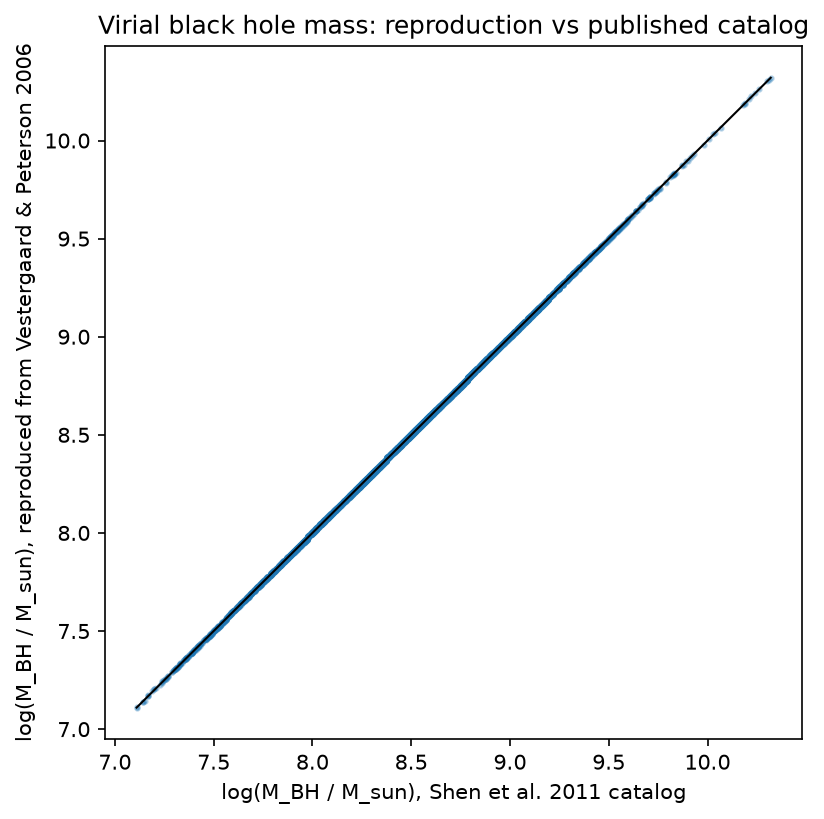
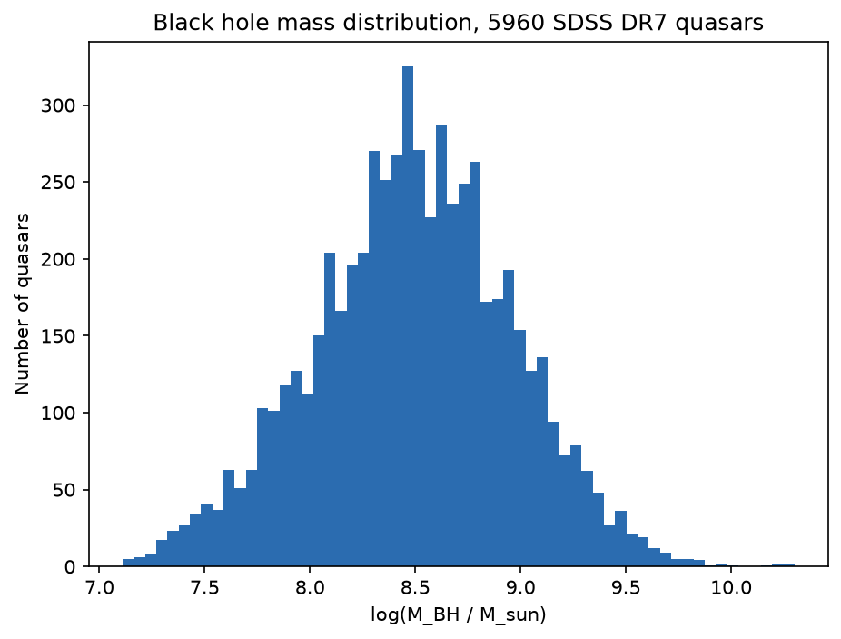
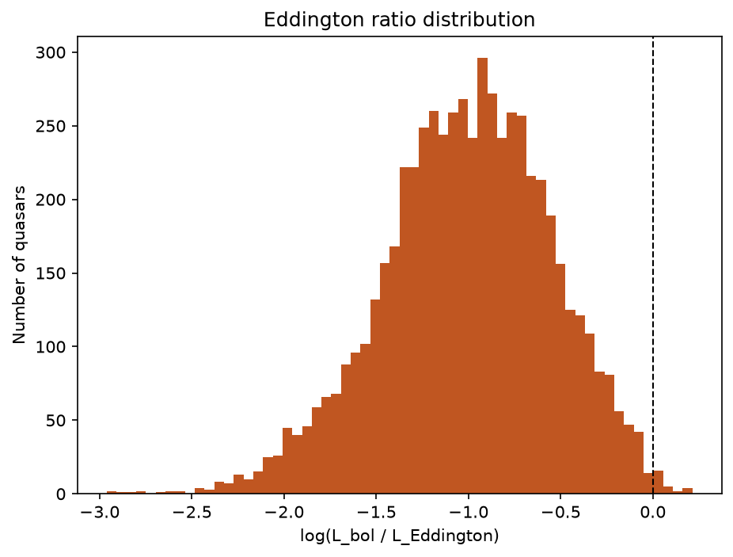
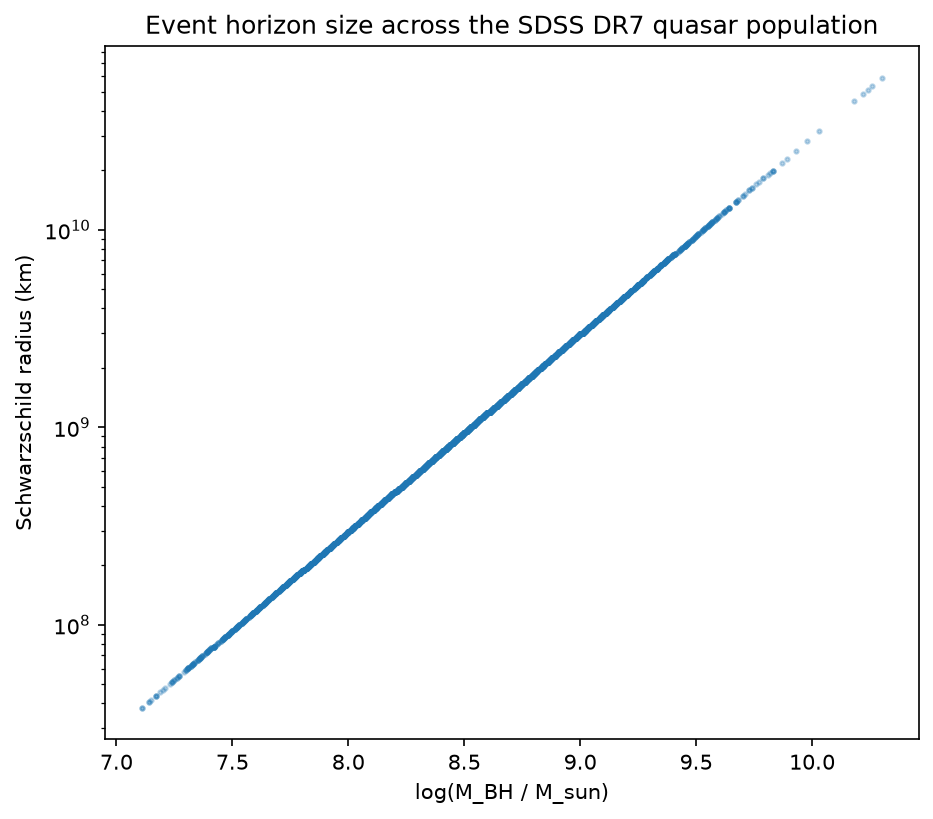

# Black Holes and Quasars

General relativity and supermassive black hole demographics, grounded in two real datasets: the Shen et al. (2011) SDSS DR7 quasar catalog and the Event Horizon Telescope shadow measurements of M87* and Sgr A*.

## Contents

- `src/schwarzschild.py`: Schwarzschild metric quantities (event horizon, photon sphere, ISCO, gravitational redshift)
- `src/kerr.py`: Kerr metric quantities as a function of spin (horizon, ISCO, photon sphere, prograde/retrograde), following Bardeen, Press & Teukolsky (1972)
- `src/accretion.py`: Eddington luminosity and the Vestergaard & Peterson (2006) virial black hole mass estimator
- `src/shadow.py`: black hole shadow angular diameter from the critical photon impact parameter
- `src/data_loader.py`: parses the raw VizieR catalog into a clean sample
- `data/fetch_shen2011_catalog.py`: reproducible fetch of the real quasar catalog from VizieR
- `analysis/run_analysis.py`: runs the full analysis on real data and produces the plots below
- `tests/`: validates the implementation against known physical results and real observations

## Data

`data/shen2011_raw.tsv` is a 30,000-quasar sample from Shen et al. (2011, ApJS 194, 45), a catalog of continuum and emission-line measurements and virial black hole mass estimates for the 105,783 quasars in the SDSS DR7 quasar catalog, obtained from VizieR (J/ApJS/194/45). The full catalog can be re-fetched with `data/fetch_shen2011_catalog.py`.

## Method

Black hole masses are estimated with the single-epoch virial method, using the Hbeta line width and the 5100A continuum luminosity as a proxy for the broad-line region radius (Vestergaard & Peterson 2006, ApJ 641, 689):

```
log(M_BH / M_sun) = 6.91 + 0.50 * log10(L5100 / 1e44 erg/s) + 2 * log10(FWHM_Hbeta / 1000 km/s)
```

This implementation is reproduced independently in `src/accretion.py` and validated against the mass values published in the catalog itself.

Event horizon, photon sphere, and ISCO radii follow directly from the Schwarzschild and Kerr solutions. The black hole shadow angular diameter uses the critical impact parameter for photon capture, `b_crit = 3*sqrt(3)*r_g`, and is checked against the actual Event Horizon Telescope measurements of M87* (EHT Collaboration 2019, ApJL 875, L1) and Sgr A* (EHT Collaboration 2022, ApJL 930, L12).

## Results

Sample: 5,960 SDSS DR7 quasars with a measured Hbeta line and no broad absorption line flag.

Mass reproduction: median offset -0.000 dex, scatter 0.003 dex against the catalog's published virial masses.

| Object | Predicted shadow diameter | Measured (EHT) |
|---|---|---|
| M87* | 39.7 uas | 42.0 +/- 3 uas |
| Sgr A* | 52.1 uas | 51.8 +/- 2.3 uas |






## Running it

```bash
python -m venv .venv
.venv/bin/pip install -r requirements.txt
.venv/bin/python -m pytest -q
.venv/bin/python -m analysis.run_analysis
```
