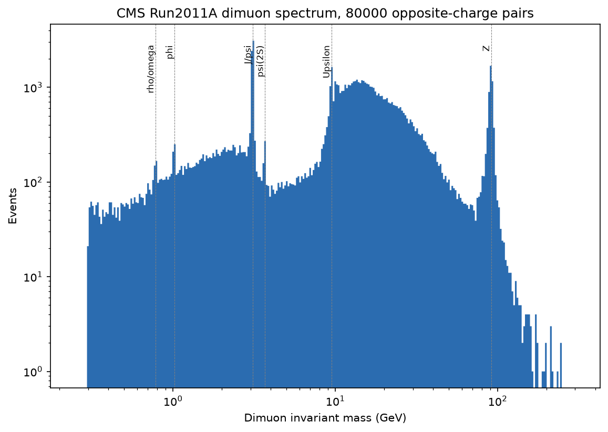
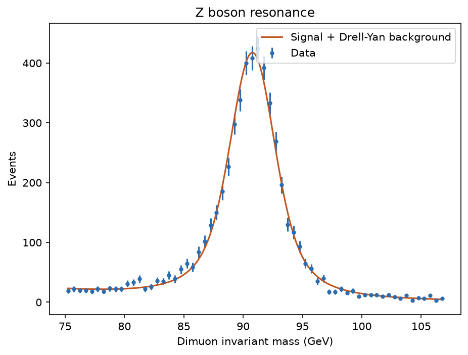

# Particle Physics: Dimuon Spectrum

The full spectrum of dimuon resonances, from the rho meson to the Z boson, extracted from real proton-proton collision data recorded by the CMS detector at the LHC, with a resonance fit that recovers the PDG world-average Z boson mass and width.

## Contents

- `src/kinematics.py`: relativistic invariant mass from two 4-momenta
- `src/resonance_fit.py`: relativistic Breit-Wigner, convolved with a Gaussian detector resolution, plus an exponential background
- `src/data_loader.py`: loads and charge-selects the real dimuon sample
- `data/fetch_cms_dimuon_data.py`: reproducible fetch and subsampling of the real CMS Open Data
- `analysis/run_analysis.py`: runs the full analysis on real data and produces the plots below
- `tests/`: validates the kinematics against the published dataset and the resonance fit against PDG values

## Data

`data/dimuon_sample.csv` is an 80,000-event random subsample (fixed seed) of the CMS Open Data Run2011A DoubleMu primary dataset: real proton-proton collisions at 7 TeV recorded by the CMS experiment in 2011, released by CERN for education and open science. Each event records the reconstructed 4-momentum and charge of two muons. The full ~475,000-event dataset can be re-fetched with `data/fetch_cms_dimuon_data.py`.

Source: [cms-opendata-education/zboson-exercise](https://github.com/cms-opendata-education/zboson-exercise), CMS Collaboration, CERN Open Data Portal.

## Method

The invariant mass of each opposite-charge muon pair is computed directly from the two 4-momenta:

```
M = sqrt((E1+E2)^2 - (px1+px2)^2 - (py1+py2)^2 - (pz1+pz2)^2)
```

and cross-checked against the mass value already published in the dataset. Plotting this mass across the full range reveals the light unflavored meson resonances (rho/omega, phi), the charmonium states (J/psi, psi(2S)), the Upsilon family, and the Z boson, all in a single real dataset.

The Z peak is modeled as a relativistic Breit-Wigner convolved with a Gaussian detector resolution term, plus an exponential Drell-Yan continuum background, and fit to the binned mass spectrum with `scipy.optimize.curve_fit`. Fitting the resonance alone (no background term) biases the recovered width upward, since the continuum contributes real counts under the peak; including it recovers a width consistent with the PDG value.

## Results

Sample: 80,000 real dimuon events, 5,383 in the 75-107 GeV fit window.

| Quantity | Fitted | PDG world average |
|---|---|---|
| Z mass | 90.795 +/- 0.043 GeV | 91.1876 GeV |
| Z width | 2.699 +/- 0.347 GeV | 2.4952 GeV |

Invariant mass reproduction: median residual -8e-08 GeV against the dataset's own published values.




## Running it

```bash
python -m venv .venv
.venv/bin/pip install -r requirements.txt
.venv/bin/python -m pytest -q
.venv/bin/python -m analysis.run_analysis
```
