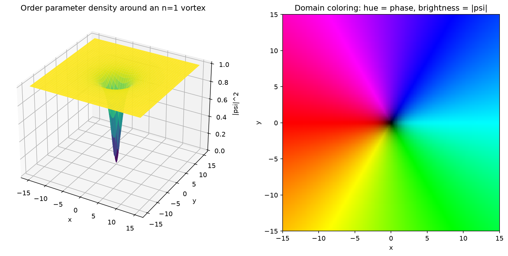
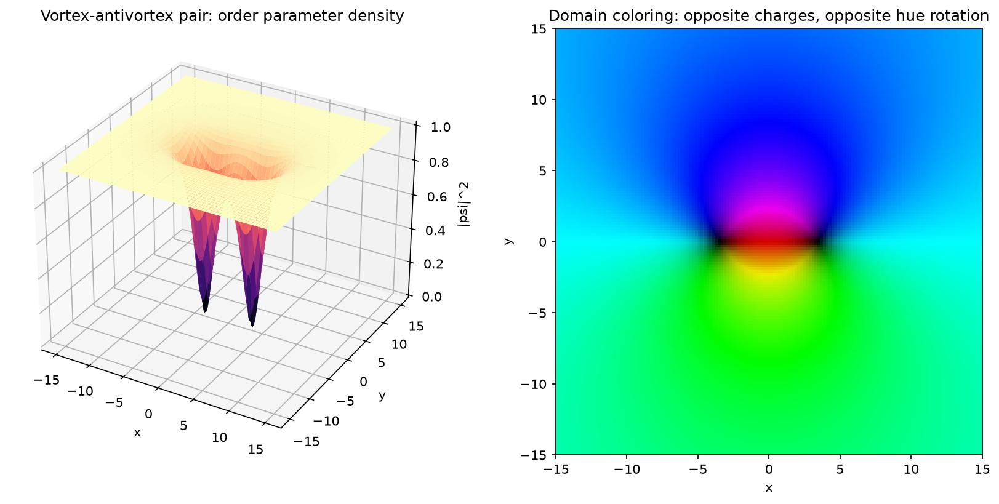
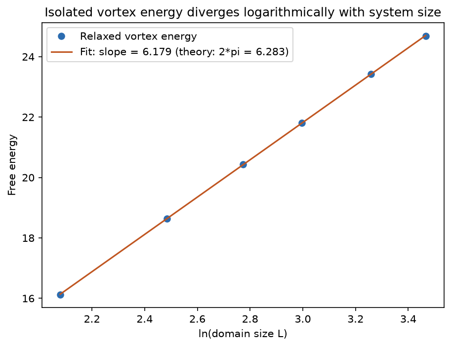

# Topological Field Theory: Ginzburg-Landau Vortices

Topological defects in a complex scalar field, obtained by numerically solving a nonlinear partial differential equation, classified by an integer-valued homotopy group, and validated against a known analytic scaling law.

## Physics

The Ginzburg-Landau free energy for a complex order parameter psi(x, y):

```
F[psi] = Integral [ |grad psi|^2 + (1/2)(1 - |psi|^2)^2 ] dx dy
```

is minimized by gradient flow, `d psi/dt = -dF/dpsi* = grad^2 psi + psi(1 - |psi|^2)`, a nonlinear reaction-diffusion PDE solved here by explicit finite differences on a Dirichlet-bounded grid. Static solutions with a phase winding around a zero of psi are topological solitons: vortices.

The order parameter's phase lives on a circle, the same space as the group U(1). A configuration is classified by an element of the first homotopy group, `pi_1(U(1)) = Z` (Mermin, Rev. Mod. Phys. 51, 591, 1979): an integer winding number, computed here directly from the field as `(1/2*pi)` times the total phase change around a loop. This is the same quantity as the Poincare-Hopf index of the zero of the real 2D vector field `(Re psi, Im psi)`.

## Contents

- `src/ginzburg_landau.py`: grid setup, vortex ansatz, finite-difference Laplacian, gradient-flow relaxation, free energy functional
- `src/topology.py`: winding number of a field configuration around a loop
- `analysis/run_analysis.py`: relaxes single-vortex and vortex-antivortex configurations, verifies the energy scaling law, and produces the plots below
- `tests/`: winding number quantization and additivity, energy monotonicity under gradient flow, and the analytic scaling law

## Results

A single vortex has topologically protected, exactly quantized winding number (1.0000 recovered numerically) and a density profile vanishing at the core:



Fusing two vortices multiplies their order parameters and adds their windings: this is the group law of `pi_1(U(1)) = Z` acting on the field, verified both algebraically (`test_winding_number_is_additive_under_field_multiplication`) and by directly relaxing a vortex-antivortex pair, whose individual charges recover +1 and -1 while a large loop enclosing both recovers exactly 0:



An isolated vortex has no natural length scale to cut off its phase gradient, so its energy grows without bound as the system size increases. Kosterlitz and Thouless (J. Phys. C 6, 1181, 1973) give the asymptotic result `E(R) ~ 2*pi*n^2*ln(R)` for winding number n; relaxing a single vortex at six domain sizes and fitting the energy recovers a slope of 6.179, within 1.7% of the theoretical `2*pi = 6.283`:



This same logarithmic divergence, cut off by pairing opposite charges, is the mechanism behind the Kosterlitz-Thouless phase transition in two-dimensional superfluids and superconductors.

## Running it

```bash
python -m venv .venv
.venv/bin/pip install -r requirements.txt
.venv/bin/python -m pytest -q
.venv/bin/python -m analysis.run_analysis
```
